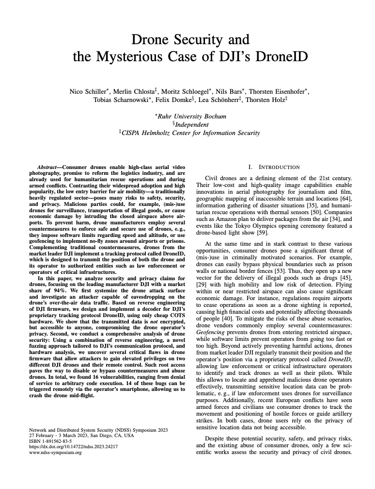
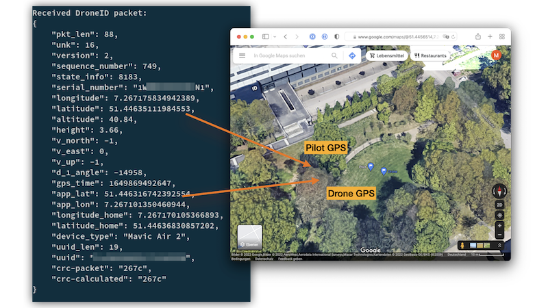
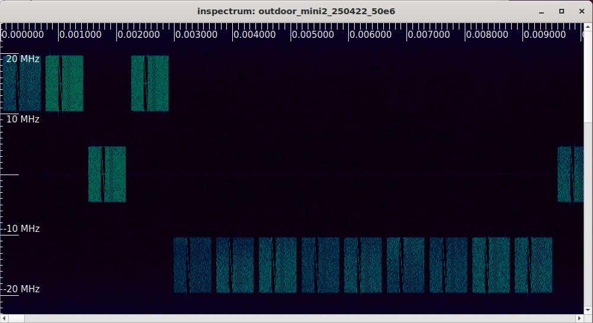
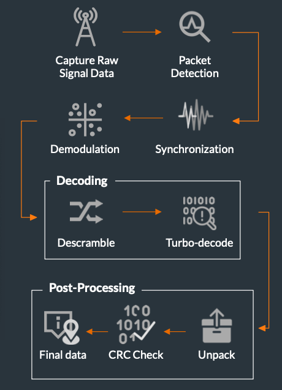

# Drone-ID Receiver for DJI OcuSync 2.0

<p><a href="https://www.ndss-symposium.org/wp-content/uploads/2023/02/ndss2023_f217_paper.pdf"></a></p>

This project is a receiver for DJI's Drone-ID protocol. The receiver works either live with an SDR, or offline on pre-recorded captures.

Our paper from NDSS'23 explains the protocol and receiver design: [Drone Security and the Mysterious Case of DJI's DroneID](https://www.ndss-symposium.org/wp-content/uploads/2023/02/ndss2023_f217_paper.pdf) [pdf]

> If you're looking for the fuzzer, we will upload that shortly :)

The live receiver was tested with:
* Ettus USRP B205-mini
* DJI mini 2, DJI Mavic Air 2

Our software is a proof-of-concept receiver that we used to reverse-engineer an unknown protocol. Hence, it is not optimized for bad RF conditions, performance, or range.

<p></a></p>

## Sample Files

We provide sample files in the `samples/` folder.

The samples were directly dumped from the first stage of the live receiver that
*detects* candidate frames and performs no other data processing; it usually hands
them directly to the rest of the code that you can test offline.

You can use `inspectrum` to visualize the raw sample file:

```
sudo apt install inspectrum
inspectrum samples/mini2_sm.sigmf-data
```

</a></p>

## Quick Start (Offline)

Create a virtual environment for Python and install the requirements:

```
python3 -m venv .venv
source .venv/bin/activate
pip3 install -r requirements.txt 
```

You can now run the decoder on the sample file:
```
./src/droneid_receiver_offline.py -i samples/mini2_sm.sigmf-data
```

### Results

The script performs detection and decoding just as the live receiver would. It prints the decoded payload for each Drone-ID frame:

```json
## Drone-ID Payload ##
{
    "pkt_len": 88,
    "unk": 16,
    "version": 2,
    "sequence_number": 878,
    "state_info": 8179,
    "serial_number": "SecureStorage?",
    "longitude": 7.267960786785307,
    "latitude": 51.446866781640146,
    "altitude": 39.32,
    "height": 5.49,
    "v_north": 0,
    "v_east": -7,
    "v_up": 0,
    "d_1_angle": 16900,
    "gps_time": 1650894901980,
    "app_lat": 43.26826445428658,
    "app_lon": 6.640125363111847,
    "longitude_home": 7.26794359805882,
    "latitude_home": 51.446883970366635,
    "device_type": "Mini 2",
    "uuid_len": 0,
    "uuid": "",
    "crc-packet": "c935",
    "crc-calculated": "c935"
}
```

The summary contains decoding stats and flight path. In the `mini2_sm.sigmf-data` sample, the drone did not have GPS coordinates locked yet, and only the smartphone's location is transmitted:
```
$ ./src/droneid_receiver_offline.py -i samples/mini2_sm.sigmf-data
… … …
Frame detection: 10 candidates
Decoder: 9 total, CRC OK: 7 (2 CRC errors)
Drone Coordinates:
App Coordinates:
(51.447176178716916, 7.266528392911369)
(51.447176178716916, 7.266528392911369)
…
(51.447176178716916, 7.266528392911369)
```

For `samples/mavic_air_2.sigmf-data` both locations are transmitted:
```
$ ./src/droneid_receiver_offline.py -i samples/mavic_air_2.sigmf-data
…
Decoder: 1 total, CRC OK: 1 (0 CRC errors)
Drone Coordinates:
(51.44633393111904, 7.26721594197086, 12.8)
App Coordinates:
(51.44620788045814, 7.267101350460944)
```

# Live Receiver

The live receiver additionally requires the UHD driver and **quite powerful machines** (for captures at 50 MHz bandwidth).

Environment:
* Ettus USRP B205-mini
* DJI mini 2, DJI Mavic Air 2

First, setup the Python environment. Due to the UHD driver, this does not work with a virtual environment. If you previously activated a virtual environment, exit that environment first. Install Python requirements:
```
pip3 install -r requirements.txt
```

Install UHD:
```
sudo apt install libuhd-dev uhd-host python3-uhd
```

Run the receiver:

```
./src/droneid_receiver_live.py 
```

The receiver will hop through a list of frequencies and, if a drone is detected, lock on that band.

## Deeper Dive: Script output

<p></a></p>

> If you're looking for a deeper dive into the processing steps, we suggest calling the offline decoder with `--debug`. This will **enable a GUI** with step-by-step decoding.
> ```
> ./src/droneid_receiver_offline.py -i samples/mini2_sm.sigmf-data
> ```


First, the `SpectrumCapture` class performs *packet detection* and splits the capture file into individual frames:
```
Packet #0, start 0.000076, end 0.000721, length 0.000644, cfo -12207.031250
Packet #1, start 0.000811, end 0.001456, length 0.000644, cfo 0.000000
Packet #2, start 0.001546, end 0.002191, length 0.000644, cfo 0.000000
…
```

Some of these packets are false-positives and we do not expect successful decoding. Start and end are in seconds, so you can use inspectrum to take a look at individual frames.

Next, the `Packet` class detects the Zadoff-Chu sequences and performs time and frequency offset corrections. It splits the frames into individual OFDM symbols.
```
FFO: -6546.528614
Found ZC sequences: 600 147
ZC Offset: -2.867868
```

The `Decoder` class gets the OFDM symbols and demodulates the subcarriers using QPSK. We do not know the QPSK orientation here, hence, we simply brute-force the orientation. `decoder.magic()` performs the descrambling and turbo-decode.

`DroneIDPacket` unpacks the resulting bitstream into the Drone-ID struct. At this point the message could be decoded, but might be corrupted (CRC check needed).

CRC check FAIL is easy to spot by looking at the Serial Number (should read 'SecureStorage?'):
```
    "serial_number": "Sa#upeStore&q?\u0010\b",
    …
    "crc-packet": "d985",
    "crc-calculated": "9b01"
}
CRC Check FAILED!
```

At the very end, we print some statistics:
```
Successfully decoded 14 / 34 packets
4 Packets with CRC error
```

So in total we decoded 18 packets, 14 with correct CRC. Again, this is *expected* as the sample file includes Drone-ID Frames with greatly varying quality.

# FAQ - Frequently Asked Questions

Is DJI's Drone-ID the same as the standardized, Bluetooth or WiFi-based "Remote ID"?
> No. DJI uses a dedicated wireless protocol for its Drone-ID, hence the need to implement an receiver. Check [www.opendroneid.org](https://www.opendroneid.org) for an in-depth description of the EU/US-wide standard.

Can I use *this software* to locate drones from other manufacturers?
> No. This software decodes DJI-specific protocols. It does not work with WiFi or Bluetooth-based "Remote ID".

Can I locate drones without this software?
> Maybe. Since mid-2022, the US or EU started requiring drone manufacturers to implement "Drone Remote ID" - an international standard that works on top of WiFi or Bluetooth. You can use a smartphone app to locate drones that support the standard.

# Citing the Paper

If you would like to cite our work, use the following BibTex entry:
```
@inproceedings{schiller2023drone,
  title={Drone Security and the Mysterious Case of DJI's DroneID},
  author={Schiller, Nico and Chlosta, Merlin and Schloegel, Moritz and Bars, Nils and Eisenhofer, Thorsten and Scharnowski, Tobias and Domke, Felix and Sch{\"o}nherr, Lea and Holz, Thorsten},
  booktitle={Network and Distributed System Security Symposium (NDSS)},
  year={2023}
}
```
